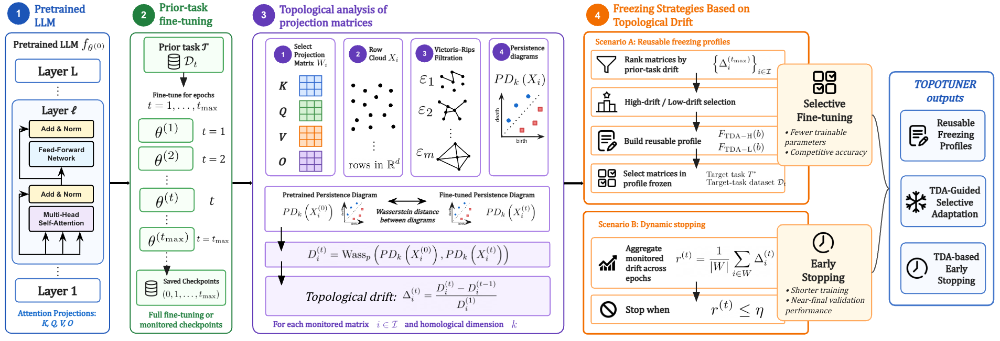
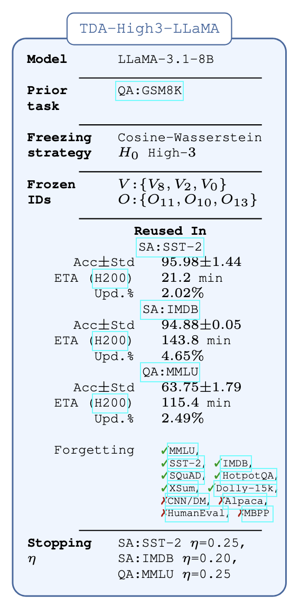

# TopoTuner: Topological Fine-Tuning of Large Language Models

TopoTuner is a topology-guided fine-tuning framework for large language models. It measures how attention projection matrices reorganize during fine-tuning and uses this signal to build reusable freezing profiles and support topology-based early stopping.

The main idea is to treat each attention projection matrix as a row cloud, compute persistent homology on this geometric representation, and measure structural change using Wasserstein distances between persistence diagrams. The resulting topological drift scores are used to decide which projection matrices should be frozen during later fine-tuning runs.

## Overview

TopoTuner has two main use cases:

1. **Reusable freezing profiles**  
   A prior fine-tuning run is used to rank attention projection matrices by topological drift. The selected high-drift or low-drift matrices are then frozen when fine-tuning the same model on new datasets.

2. **Topology-based early stopping**  
   During fine-tuning, TopoTuner monitors epoch-to-epoch topological drift and stops training when the monitored matrices stabilize.

## Reusable Freezing Profiles

Each freezing profile records:

- pretrained model
- prior task
- freezing strategy
- frozen projection IDs
- transferred to
- topology-based stopping threshold

## Models

The experiments use the following pretrained open-weight language models:

- LLaMA-3.1-8B
- Mistral-7B-v0.3
- Qwen3-8B-Base

## Datasets

TopoTuner is evaluated on question answering (GSM8K, MMLU), sentiment analysis (IMDB, SST-2), information retrieval (HotpotQA, SQuAD v1.1), summarization (CNN/DailyMail, XSum), instruction following (DataBricks Dolly-15k, Alpaca), and code generation tasks (HumanEval, MBPP).

